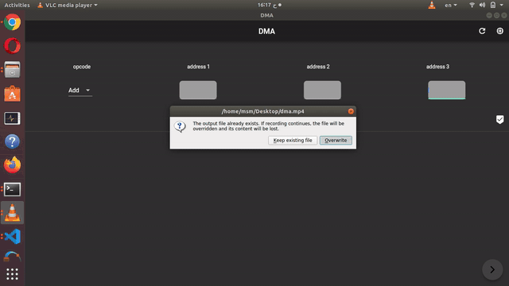

# DMA
DMA is simply implementation for 8237A using verilog and flutter desktop for linux. It's project in computer organization (3rd year Computer Engineering).

## Contents
* Team members
* issue

# Team members
* Mohamed Elesaily
* Mohamed Hamada
* Mahmoud Benyamin
* Mohamed Obada
* Hady Ashraf

## issue
Hardware isn't completed. it implement only one instruction at one time. 
